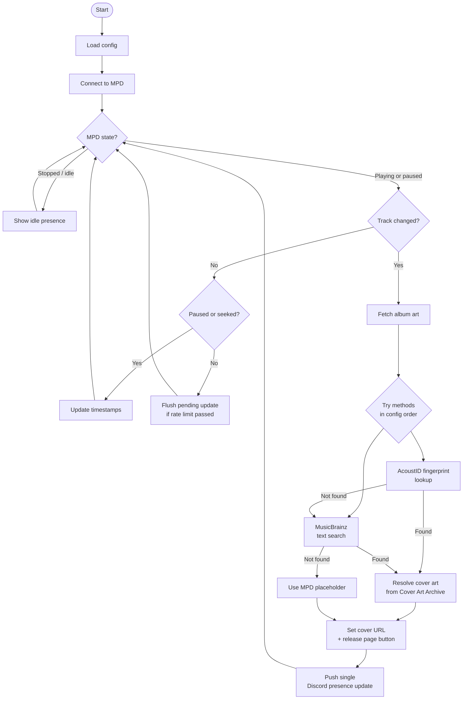

# MPD-Presence

A Discord Rich Presence client for [MPD](https://www.musicpd.org/) (Music Player Daemon). Automatically displays your currently playing track on your Discord profile, complete with album art fetched from MusicBrainz / Cover Art Archive.

---

## Features

- Displays track title, artist, album, and release year in Discord
- Album art lookup via **AcoustID fingerprint** and/or **MusicBrainz text search**
- Configurable button (e.g. "View Album" linking to the MusicBrainz release page)
- Seek, pause/resume, and idle state detection
- Discord rate-limit aware — deferred updates are flushed automatically
- Persistent MPD connection with automatic reconnect

---

## How It Works



---

## Configuration

Create a file named `MPD-Presence.conf` in the working directory:

```ini
# MPD connection
host        = localhost
port        = 6600
password    =               # leave empty if no password

# Path to your music folder (must end with /)
music_folder = /home/user/Music/

# Logging level: none | info | debug
verbose     = info

# Album art lookup method order (comma-separated)
# fingerprint = AcoustID chromaprint (more accurate)
# search      = MusicBrainz text search (fallback)
method_order = fingerprint,search

# Optional Discord buttons (leave blank to use auto "View Album" button)
Button1Label =
Button1Url   =
Button2Label =
Button2Url   =
```

---

## Dependencies

| Library | Purpose |
|---|---|
| [libmpdclient](https://www.musicpd.org/libs/libmpdclient/) | MPD communication + Chromaprint fingerprinting |
| [discord-presence](https://github.com/EclipseMenu/discord-presence) | Discord Rich Presence (Modern C++ rewrite) |
| [libcurl](https://curl.se/libcurl/) | HTTP requests (MusicBrainz, AcoustID, Cover Art Archive) |
| [nlohmann/json](https://github.com/nlohmann/json) | JSON parsing |

---

## Build

```bash
mkdir build && cd build
cmake ..
make
```

---

## Running

```bash
./MPD-Presence
```

The process will run in the foreground. Stop it with `Ctrl+C` or send `SIGTERM`.

---

## Album Art Resolution

When a track changes, the following sequence runs before the presence update is pushed:

1. If `fingerprint` is listed first and a Chromaprint fingerprint is available, query **AcoustID** for matching release IDs.
2. For each release ID returned, check **Cover Art Archive** for a front image.
3. If no match is found (or `fingerprint` is not configured), fall back to a **MusicBrainz text search** using artist + album + date.
4. If nothing resolves, the default `mpd` placeholder image is used.

Results are cached in memory for the lifetime of the process so repeated lookups for the same track are free.
